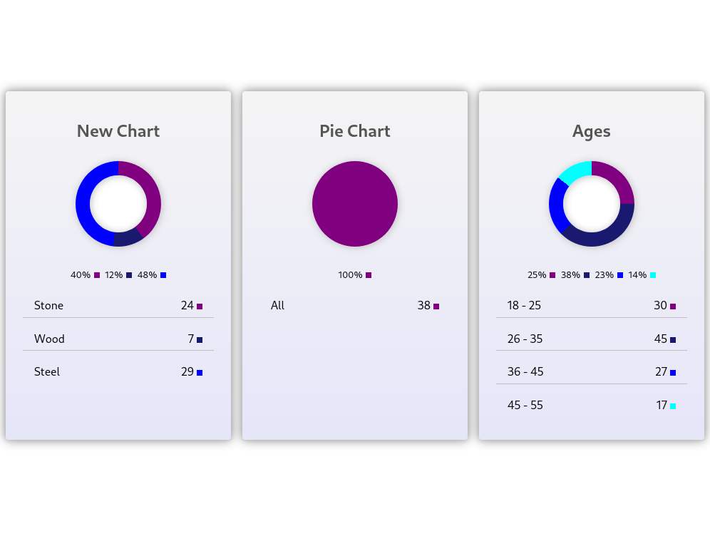

# Charty, a small library for charts

Charty is a simple library to draw pie and donut charts. Just that, simple to use. 

To use it, just link de library with `<script src="charty.js">` and between the `<header>` tag link the css file `<link rel="stylesheet" rel="charty.css"` (you can define your own css).



## How to start using it.

```javascript
const chart = new Charty({}) 	//for an empty chart(withe examle data)

const chart = new Charty({ 		//With options, everyone is optional except data
    title: 'My Chart',			//The title of the chart
    chartType: 'circle',		//The type of chart, circle(donut) or pie
    data: [						//An array of objects int he format name/value
        {Apples: 45},			//{Name: Value}
        {Oranges: 37},
        {Bananas: 52}
    ],
    precision: false,		//If the data chart have decimal numbers(just two)
    selector: '#app'		//Where the chart will be inserted, must be a valid css selector (default to body)
})
```


## Add additional data

The charts accept insert additional data with the next method:

```javascript
chart.addData({"Name", Value}) //Name: String, Value: Integer
```

**The chart will  be redrawn after insert data**


## Manipulate the chart

If you want to manipulate the chart's DOM, you can do it through the ID of the chart, every chart have a data-chart-id attribute, and every chart have a unique ID.

```javascript
const DIV = document.querySelector(`[data-chart-id="${chart.id}"]`)
//Remove the background gradient
DIV.style.backgroundImage = 'none'
//The background will be changed
DIV.style.backgroundColor = 'lightyellow'
```

**By default the charts have a light gradient**


## Change chart colors

By default the colors are static, if you want to change they, yo must edit the file `charty.js` and change the colors array in the `getColor` method.

```javascript
getColor(index) {
    const colors = [
      'purple', //Change these colors
      'midnightblue',
      'blue',
      'cyan',
      'magenta',
      'yellow',
      'dimgray',
      'orange',
      'brown',
      'indigo',
      'pink',
      'gold'
    ];
    return colors[index];
  };
```


If this small library is useful for you or liked you, consider to [buy a me a coffee ☕ (or pizza 🍕 😃)](https://www.buymeacoffee.com/mabreu)
